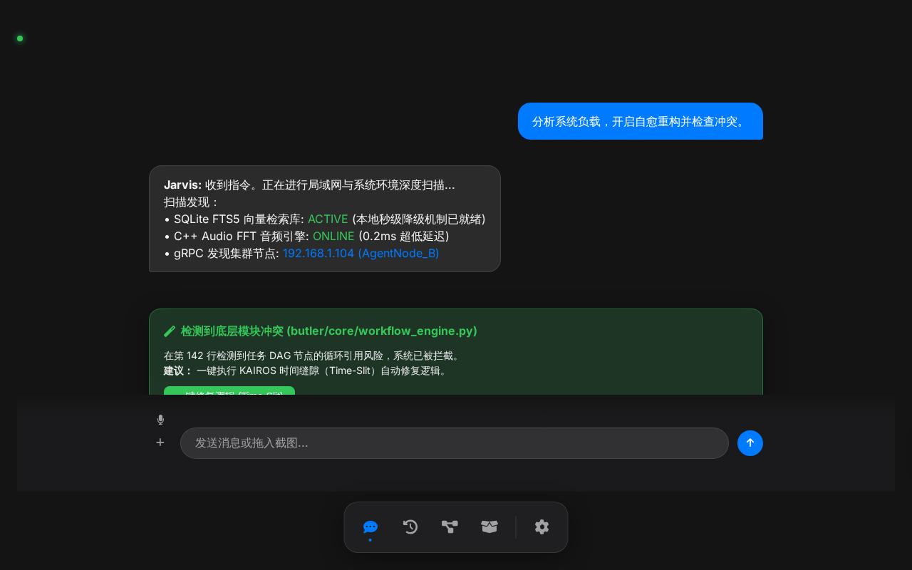
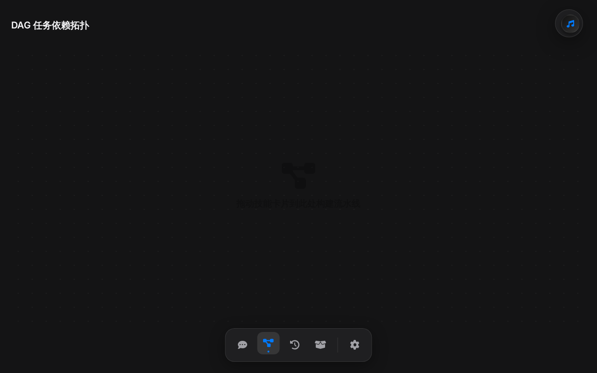
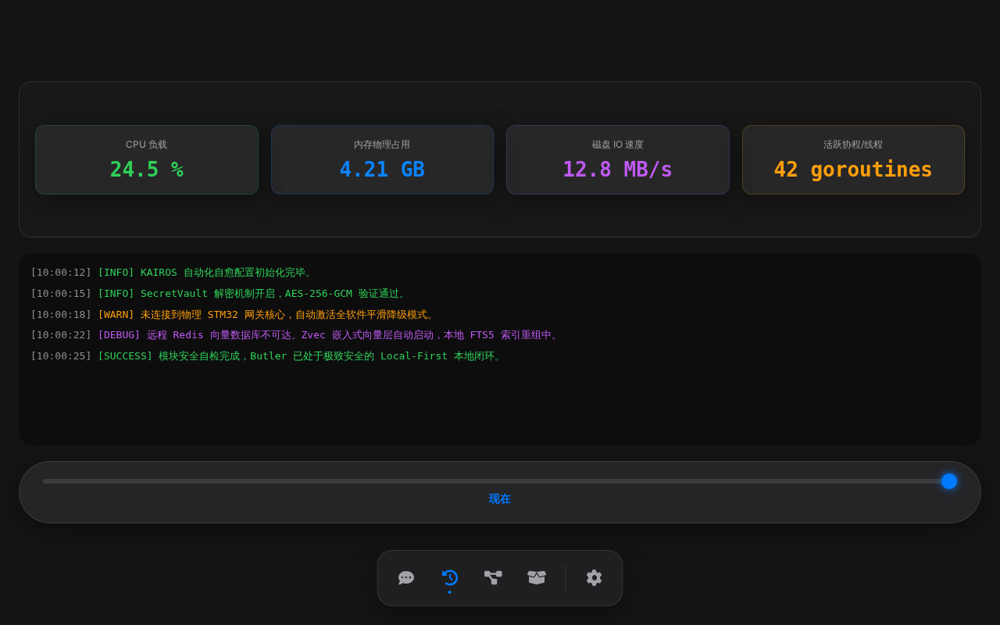
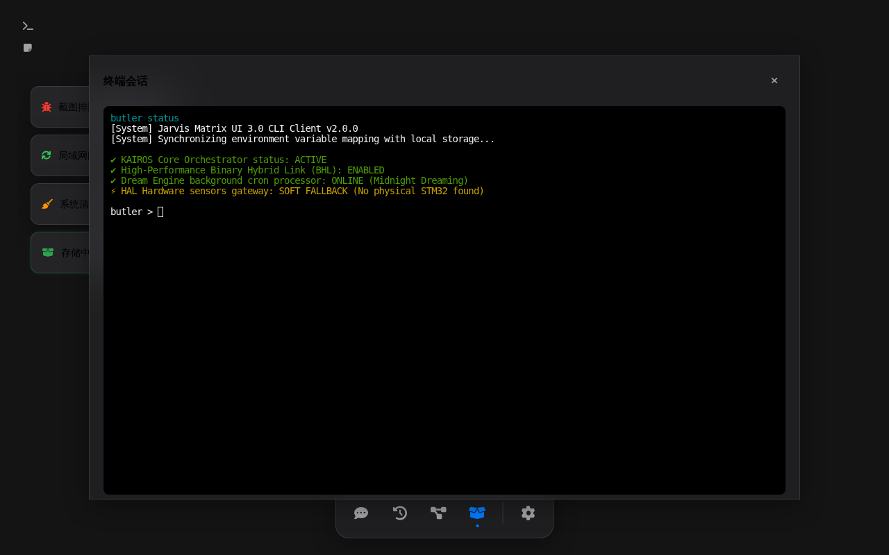

# 🤵 Butler (Jarvis) — The Ultimate Local-First Intelligent Personal Agent System

<p align="center">
  <a href="./README.md"><b>🌐 中文版</b></a>
</p>

<p align="center">
  
</p>

<p align="center">
  <a href="https://github.com/HelloEveryboby/Butler"></a>
  
  
  
  
</p>

---

## 💡 The Hook

> **Butler (Jarvis)** is a hardcore personal agent system designed entirely on a **Local-First** philosophy. Using Python as the central orchestrator and leveraging a high-performance Binary Hybrid Link (BHL) to coordinate C++/Go/Rust binaries, Butler manages your local Office/PDF documents, builds vector memories with millisecond-level graceful downgrades, and incorporates an AI-driven self-healing mechanism and background "dreaming" memory consolidation engine. It is a genuine digital life running right on your local machine.

---

## 🎨 Space Matrix: 2x2 Glassmorphism Spatial Interface

Butler UI 3.0 breaks the mold of conventional flat, one-dimensional web navigation, introducing a **$2 \times 2$ Multi-Dimensional Space Matrix**. Using `Ctrl + Arrow Keys` or two-finger swipes, you can glide seamlessly between four quadrants, blending absolute productivity with Apple-grade aesthetic tokens:

| **(0, 0) Smart Chat & Multi-Modal Diagnostics** | **(1, 0) DAG Visual Workflow Pipeline** |
| :---: | :---: |
|  |  |
| Capture screenshots for immediate troubleshooting; scans and parses compiler errors and offers one-click resolutions. | Interactive nodes built on spring physics (Hooke's Law) and glowing connections to drag-and-drop automation workflows. |
| **(0, 1) Unified Time Machine Observability** | **(1, 1) Modular Skills & File Compartments** |
|  |  |
| Cinematic rollback of system state; use the timeline slider to view past metrics, with automatic highlighting of past warnings. | "One Folder = One Skill" drawer layout featuring transparent high-performance overlay terminal and memo panels. |

*Note: Includes a fast-access floating overlay (`flash_input.html` triggered via Alt+Space) for seamless keystroke autocomplete, command submission, and full desktop control.*

---

## ⚡ Killer Features & Reimagined Solutions

### 1. One Folder = One Skill (Ultra-Decoupled Hot-Pluggable Skills)
* ❌ **The Pain**: Conventional agent architectures require sprawling configurations, static registry code, or nested imports to add new capabilities, introducing regression risks.
* 💎 **The Butler Way**: Completely modular architecture. **To create a new capability, you only need to create a single directory containing `SKILL.md` and the code**. The system dynamically scans and registers it at runtime, fully exposing it to the LLM. Completely clean and decoupled.

### 2. BHL (Python + C++/Go/Rust/C) Hybrid Link Linkage
* ❌ **The Pain**: Pure Python agents are often sluggish when dealing with heavy networking, low-latency DSP/FFT, or high-security local memory operations.
* 💎 **The Butler Way**: **Butler is engineered for high performance**. We created the **Binary Hybrid Link (BHL)**. The low-level audio DSP and FFT are written in C++, high-concurrency network tasks and real-time audits run in lightweight Go, communicating asynchronously with the Python orchestrator via binary Type-Length-Value (TLV) protocols or local gRPC. You get LLM flexibility along with low-level speed.

### 3. Graceful Multi-Level Degrading Vector Memory (Redis ➔ Zvec ➔ SQLite)
* ❌ **The Pain**: Almost all current RAG and local knowledge base projects require complex, cloud-bound vector databases or heavy Docker setups to boot up.
* 💎 **The Butler Way**: Butler includes an autonomous **multi-level memory fallback strategy**. On startup, it attempts to load local Redis; if unavailable, it switches immediately to the lightning-fast **Zvec embedded vector database** (by Alibaba); if still restricted, it degrades seamlessly to a local **SQLite instance (augmented with FTS5 full-text search)**. You get semantic memory and search 100% offline with zero external configurations.

### 4. 🌙 Dream Engine & AI Self-Healing Systems
* ❌ **The Pain**: Long-running agents accumulate massive conversation histories, bloating context tokens and slowing down inference. They also crash or freeze easily when API calls fail or files get locked.
* 💎 **The Butler Way**:
  * **Dream Engine**: In periods of low system usage or late at night, Butler senses CPU and battery load and boots up the dreaming process. It takes the past three days of logs, consolidates them via the LLM into structured, high-value factual memories, deletes conversational fluff, and updates your long-term `MEMORY.md`.
  * **Self-Healing**: If any part of an execution chain throws an error (e.g., port already bound, API timeout, command failure), the Self-Healing module inspects the exception stack, leverages the LLM to design an immediate fallback or retry strategy, and dynamically executes it without human intervention.

---

## 📦 Zero-Configuration Out-of-the-Box (Portable Green Mode)

To eliminate the traditional "dependency hell," Butler incorporates its own automatic `dependency_manager.py` and isolates libraries inside the workspace.

> **💡 Complete Isolation, Zero Registry Pollution:**
> Butler supports a fully portable mode. Simply run `./install.sh`. The system automatically builds/installs all heavy dependencies (including Python runtimes, numerical libraries, audio packages) isolated inside the local `lib_external/` directory. No global system paths are polluted. Unzip to play, delete the folder to completely uninstall.

### Quick Start

1. **Clone the Repo:**
   ```bash
   git clone https://github.com/HelloEveryboby/Butler.git
   cd Butler
   ```

2. **One-Click Launch:**
   * **Windows**: Double-click `run.sh` (or `run_modern.sh` for the Glassmorphic modern web UI).
   * **Linux/macOS**: Run `./run.sh` (or `./run_modern.sh` for the Glassmorphic modern web UI).
   * *Note: Scripts automatically set up necessary local libraries and open the configuration wizard.*

3. **Minimalist Configuration:**
   Copy `.env.example` to `.env` and fill in **just one `DEEPSEEK_API_KEY` to run all core agent workflows, local RAG, and memory pipelines**:
   ```env
   DEEPSEEK_API_KEY="your_deepseek_api_key_here"
   ```

---

## ⚙️ Core Applications Suite

Beyond low-level frameworks, Butler includes several built-in desktop utilities:

* 🎙️ **Multi-Modal Voice Interaction**: Supports dual local/online modes. By default, it runs with `LocalVoiceEngine` (Faster-Whisper + pyttsx3 offline TTS) to bypass API signup limits, while Baidu Cloud and Picovoice serve as advanced drop-ins.
* 📊 **Excel Financial Wizard & PDF Assistant**: Advanced Excel processing and recalculation engines alongside full document conversion wrappers (built to Microsoft / LibreOffice standard compliance) to easily digest massive local spreadsheets.
* 🎵 **Multimedia Hub**: Full disk and mount-point (`/media`, `/mnt`) automatic scanning, enabling seamless background MP3/WAV playback with interactive offline trivia and formatting encyclopedias.
* 🔌 **Peripheral HAL Linkage & Security**:
  * **Zero-Crash Hardware Guarantees**: Integrates serial-bound USB screens, infrared/Bluetooth devices, and STM32 microcontroller gateways. If no hardware is connected, the HAL layer falls back gracefully to pure software simulation, printing a notification without interrupting the boot.
  * **Zero-Trust SecretVault**: PBKDF2 & AES-256-GCM local storage with OS-native keyring wrappers to secure API credentials.

---

## 🏗️ Repository Architecture

```text
├── butler/                   # Butler Agent Core & Main Orchestrator
│   ├── core/                 # KAIROS Automation Suite (NLU, Memory, Self-Healing, Dream)
│   ├── gui/                  # Setup & Configuration Wizards (Tkinter UI)
│   ├── hal/                  # Hardware Abstraction Layer & Peripherals Drivers
│   └── butler_app.py         # Primary Boot Entrance
├── package/                  # Modular Standalone Packages (Security, Document, Algos, Net)
├── skills/                   # One Folder = One Skill hot-pluggable directory
├── frontend/                 # 2x2 Glassmorphism Web UI Assets (HTML/CSS/JS/webview)
├── bin/                      # Unified cross-platform startup scripts (.sh / .bat)
└── docs/                     # Detailed documentation & technical Wikis
```

---

## 🤝 Contribution Guidelines

Butler is structured following strict, modern software practices. If you want to contribute your own skill, check out:
* 👉 **[Contributor Specifications & Quick Skill Creation Guide](./docs/SKILLS_GUIDE.md)**
* 👉 **[System Technical Internal Wiki: Deep Architecture Breakdown](./docs/Butler_Code_Wiki.md)**

---

## 📄 License

This project is licensed under the [MIT License](./LICENSE).
