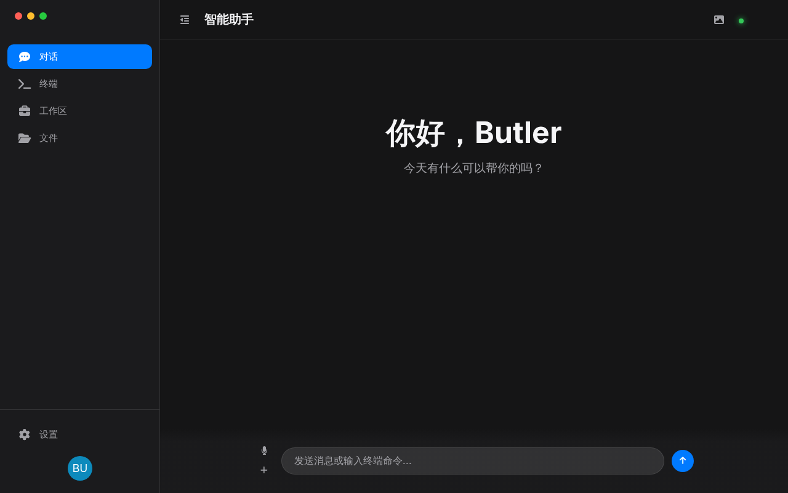
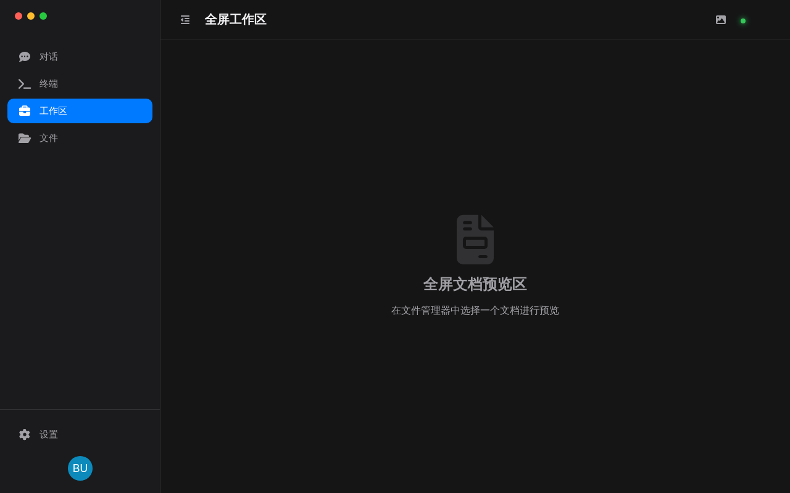
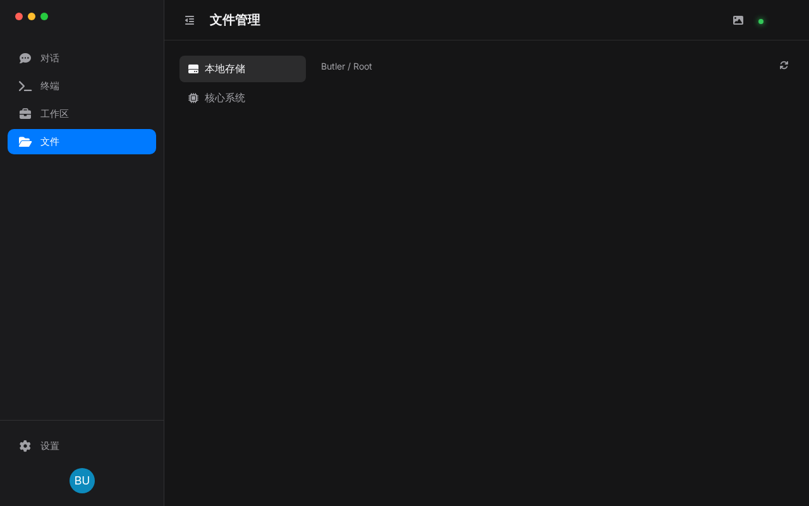
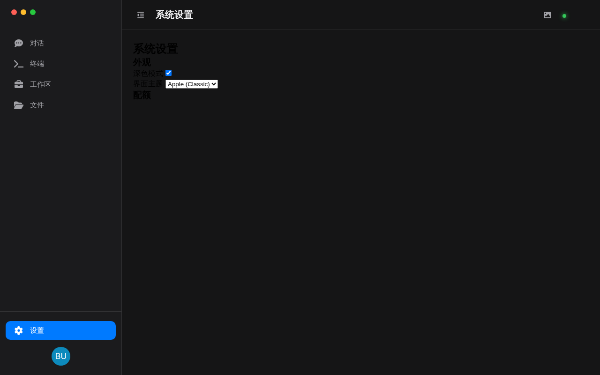

# Butler Modern UI - 现代模式界面指南

Butler 采用了一套基于 HTML/CSS/JS 的现代化**玻璃拟态 (Glassmorphism)** 设计界面。该界面受 Apple 设计风格启发，强调流式交互与简洁美感，同时保留了强大的功能扩展性。

## 核心设计理念

*   **无输入框流式交互**：核心交互集中在对话流中，支持多种富媒体输出。
*   **侧边栏驱动**：通过永久侧边栏快速切换不同的工作视窗。
*   **深色模式与透明感**：默认适配深色环境，利用高斯模糊和半透明层级提升视觉深度。
*   **跨平台响应**：支持多种屏幕尺寸，侧边栏可收缩以获得更大操作空间。

---

## 视图说明

### 1. 智能助手 (Chat)
这是系统的默认视图，提供核心的 AI 交互功能。
*   **交互流**：支持气泡式对话。AI 回复不仅包含文字，还支持：
    *   **翻译卡片**：双语对照显示。
    *   **代码块**：高亮显示并支持一键复制。
    *   **配额报告**：直观展示 API 使用进度。
    *   **富媒体**：图片、视频预览卡片。
*   **多模态输入**：支持文字输入、语音触发以及文件附件上传。

### 2. 终端 (Terminal)
集成高性能 `xterm.js` 终端。

*   **原生体验**：支持完整的 PTY 交互，可直接执行 Shell 命令。
*   **无缝切换**：在 Chat 中输入的系统命令也会同步反映在终端状态中。

### 3. 全屏工作区 (Workspace)
专为深度办公设计。

*   **文档预览**：支持 PDF、Markdown、Word 等文档的直接渲染。
*   **专注模式**：提供无干扰的全屏阅读环境，支持在侧边进行文档翻译。

### 4. 文件管理 (Files)
内置文件浏览器。

*   **双域管理**：支持切换“本地存储”与“核心系统”路径。
*   **快速操作**：点击文件可直接在工作区打开预览或进行相应处理。

### 5. 系统设置 (Settings)

*   **外观定制**：支持深色/浅色模式切换，以及不同主题风格的选择（如 Apple Classic 或 Modern Glass）。
*   **状态监控**：实时查看各模型 API 的配额消耗情况。

---

## 特色功能

### 状态指示灯
位于界面右上角，直观显示系统运行状态：
*   **连接状态 (Green)**：后端 WebSocket 连通性。
*   **思考状态 (Blue)**：AI 正在处理请求。
*   **语音状态 (Red)**：麦克风监听状态。

### 背景定制
点击顶部头部的图片图标，用户可以上传自定义图片作为界面背景。背景将自动应用高斯模糊效果，并持久化存储在本地浏览器缓存中。

### 独立侧边栏
点击左上角的切换图标，可以收缩侧边栏进入“极简模式”，为代码查看或文档阅读腾出空间。

---

## 开发者说明

该前端通过 `pywebview` 与 Python 后端进行双向通信：
*   **Python -> JS**: 通过执行脚本推送流式 AI 响应、终端输出及系统通知。
*   **JS -> Python**: 通过 `window.pywebview.api` 调用后端定义的处理函数（如 `handle_command`, `list_files` 等）。

代码位置：
*   `frontend/view/index.html`: 结构
*   `frontend/view/style.css`: 样式
*   `frontend/view/main.js`: 逻辑
