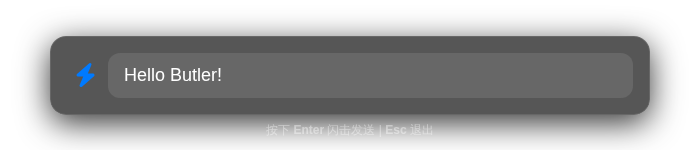
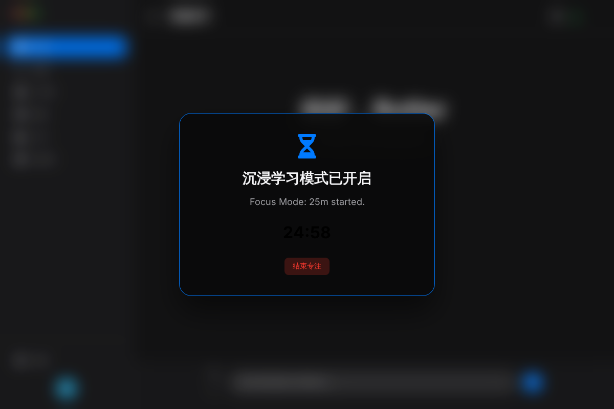
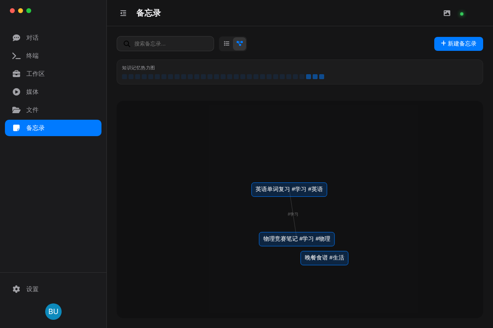

# Butler UI Upgrade Preview

This document showcases the latest visual and interactive improvements to the Butler personal assistant system.

## 1. Flash Input (P1)
**Global Hotkey:** `Alt + Space`

The Flash Input is a lightweight, frameless, and translucent window designed for "Write and Run" interaction. It allows users to quickly record notes or execute commands without switching to the main browser UI.

## 2. Spatial Card Layout (P2)
*Coming Soon* - An interactive knowledge network for memos using `vis-network`.

## 3. Memory Heatmap (P2)
*Coming Soon* - A visual representation of knowledge accumulation and review frequency.

## 3. Focus Mode (P2)
**Command:** `/focus [minutes]`

A full-screen immersive mode that silences distractions, broadcasts a "Busy" status to all connected devices, and displays a countdown timer.

## 4. Ebbinghaus Review & Heatmap (P2)
Integrated into the Memos view, the Heatmap tracks your knowledge accumulation. Memos tagged with `#Review` automatically enter the Ebbinghaus repetition cycle.

