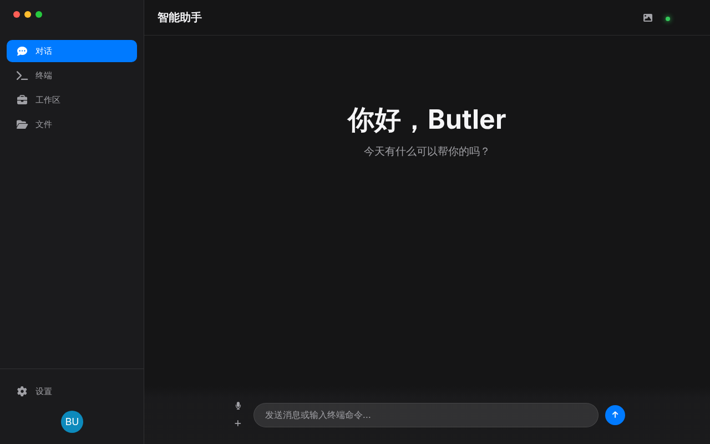
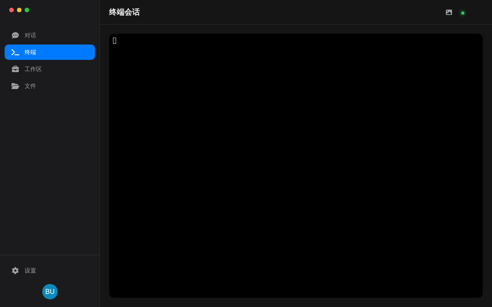
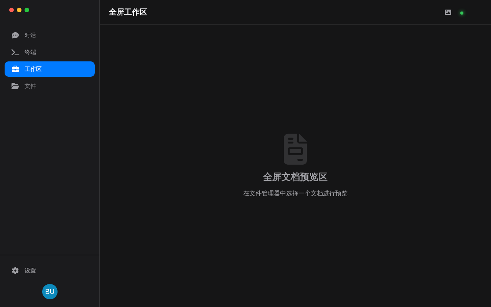
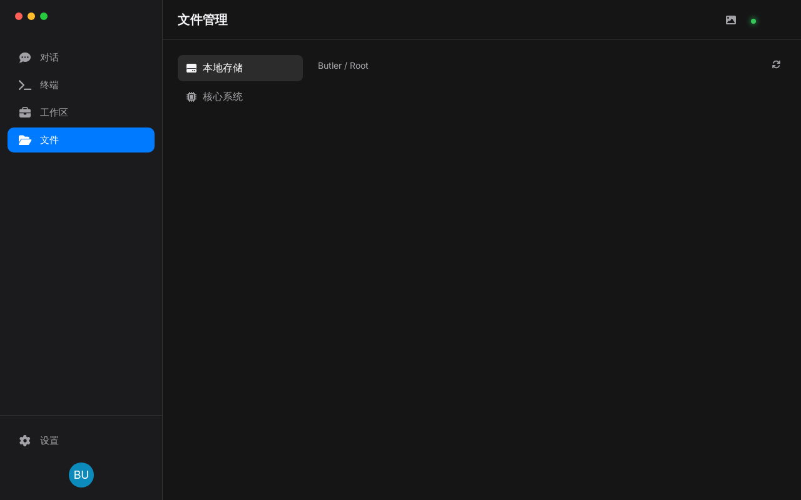
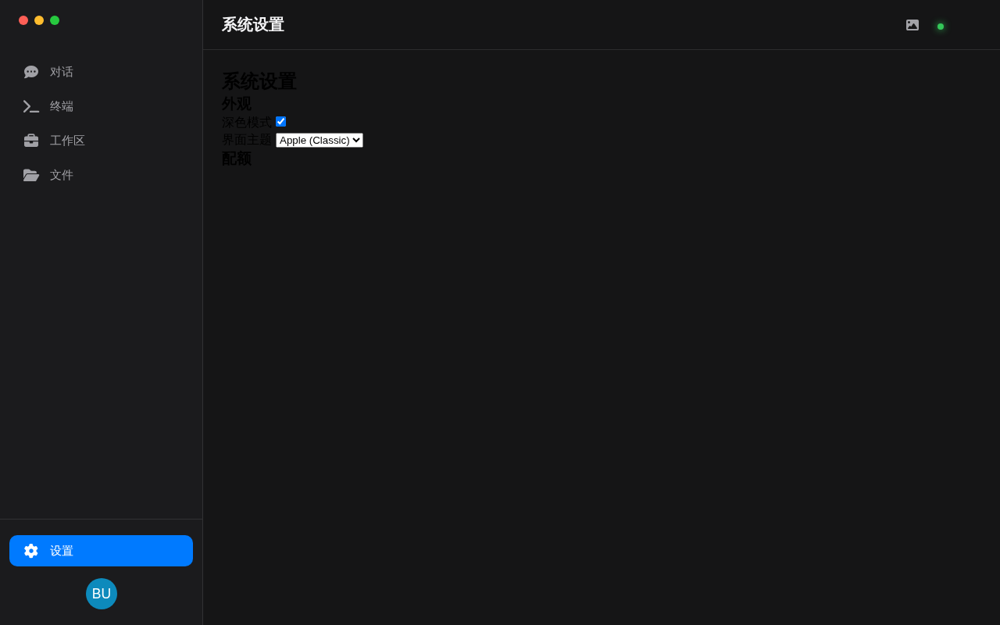
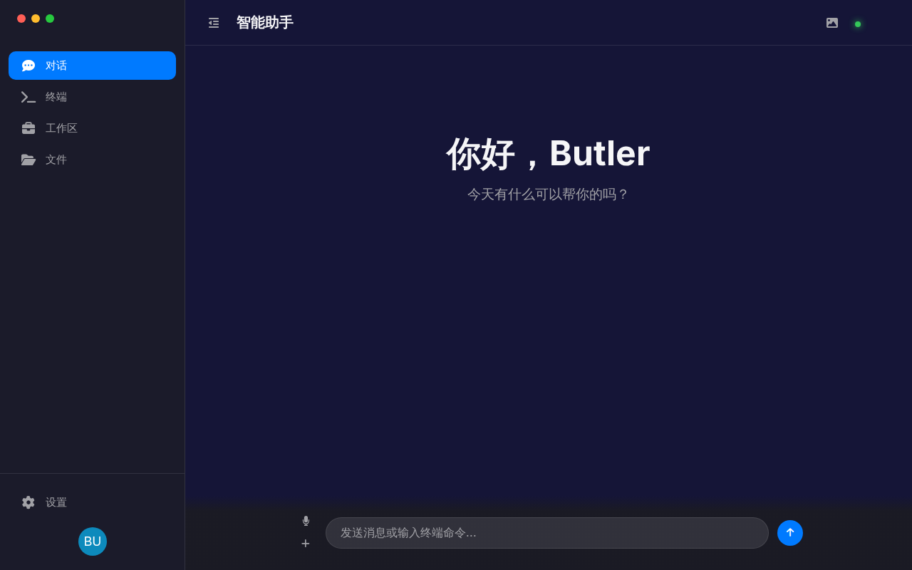

# Butler AI - 苹果风格界面指南 (Apple Style UI)

本指南介绍了 Butler AI 的全新前端界面设计，该界面旨在通过苹果（Apple/macOS）的设计理念提供极致的办公与交互体验。

---

## 🎨 设计理念

Butler AI 采用了**磨砂玻璃（Glassmorphism）**与**常驻侧边栏**的设计架构，以减少界面冗余，提升用户的专注力。

### 核心亮点：
- **极致简约**：移除所有 Google Material 3 的多余标签，采用原生 macOS 风格。
- **全屏沉浸**：每个功能模块都有专属的全屏视图。
- **动态交互**：支持侧边栏隐藏与自定义背景上传。

---

## 🧩 功能模块

### 1. 智能助手 (Chat View)

- **对话中心**：负责与 LLM 进行深度交互。
- **智能输出**：自动识别并以卡片形式展示代码块、翻译结果与系统配额。
- **混合交互**：在此输入的命令可同步分发至终端或技能引擎。

### 2. 独立终端 (Terminal View)

- **Xterm.js 驱动**：完整的终端交互体验。
- **任务隔离**：聊天归聊天，终端归终端，互不干扰且可实时连接。
- **自动适配**：终端窗口会根据侧边栏的显示/隐藏状态自动调整大小。

### 3. 文档工作区 (Workspace)

- **全屏办公**：专为 PDF、Word、Excel 等办公文档设计的预览环境。
- **深度集成**：未来将支持一键翻译全文或提取摘要。

### 4. 文件管理器 (Files Explorer)

- **可视化管理**：像本地 Finder 一样浏览和操作文件。
- **快速预览**：点击文件即可直接跳转至“工作区”进行全屏查看。

### 5. 系统设置 (Settings)

- **外观定制**：切换深/浅色模式或界面主题。
- **配额监控**：实时查看 API 额度与系统运行状态。

---

## ✨ 交互特性

### 侧边栏隐藏

点击左上角的“侧边栏控制”按钮即可一键进入全屏沉浸模式，设置将自动持久化保存。

### 自定义背景上传

通过顶部工具栏的图片按钮，您可以上传本地图片作为背景板。系统会自动应用暗色滤镜以确保文本清晰可读。

---

## 🛠️ 技术实现
- **HTML5/CSS3**：采用现代 CSS 变量与动画引擎。
- **Inter Font Family**：苹果同款高可读性字体。
- **Bridge API**：通过 PyWebView 与后端进行高效的 JSON-RPC 通信。
